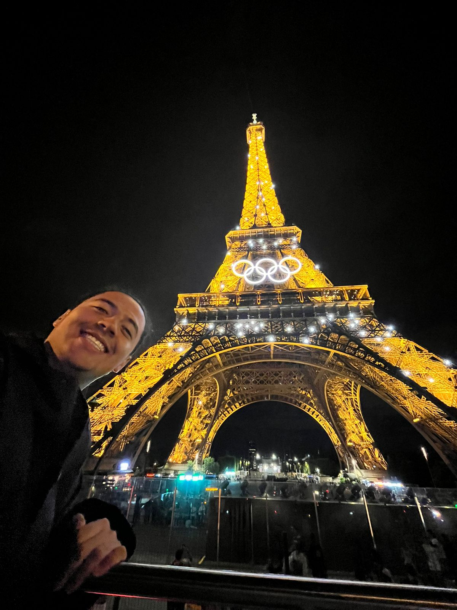

# About me

## Presentación personal

Mi nombre es Axel Manuel Vergara Páez, estoy cursando 7mo semestre de la carrera en Ingeniería en Negocios en la IBERO Puebla. Algo que me describa es que soy un poco inquieto, curioso y me encanta saber sobre los negocios y sobre la gente exitosa, incluso en el ámbito deportivo. Un ejemplo es entender el negocio del fútbol desde la perspectiva de comprar, ceder y vender jugadores.

## Una historia personal interesante

Me encanta viajar, probar cosas nuevas y enfrentarme a mis miedos. La primera vez que me subí a una montaña rusa tenía unos 12 años; el detalle estaba en que, debido a mi cabello rizado estilo afro, apenas cumplía con el requisito de altura. El resultado: me partí el labio durante el recorrido, pero esa experiencia hizo que me apasionaran las montañas rusas; ahora, siempre que tengo la oportunidad, me subo a una sin dudarlo.

## Mis intereses y hobbies

Disfruto mucho escuchar música; entre mis artistas favoritos en inglés se encuentran Michael Bublé y Bryan Adams. Sin embargo, en español me gusta mucho la música romántica, como las canciones de Chayanne o Emmanuel. También me encanta ver deportes, desde la natación y el voleibol hasta el béisbol y el fútbol americano. Entre mis equipos favoritos están el Barcelona, ​​los Dodgers, los Kansas City Chiefs y Red Bull F1, entre otros. Me interesa mucho investigar cómo lograron su éxito los emprendedores destacados; entre estas figuras se encuentran Germán Larrea y Carlos Slim, así como Amancio Ortega y Bernard Arnault.

## Dónde me veo en 5 años

En 2031, me veo trabajando en un sector como la manufactura o la logística (quizás en la industria de la confección), o bien en un ámbito donde pueda aplicar mis conocimientos tanto de negocios como de ingeniería. Me gustaría ocupar un puesto como asistente de un ejecutivo de quien pueda aprender mucho. En el plano personal, me visualizo con una pareja, considerando la posibilidad de contraer matrimonio en un futuro próximo.
