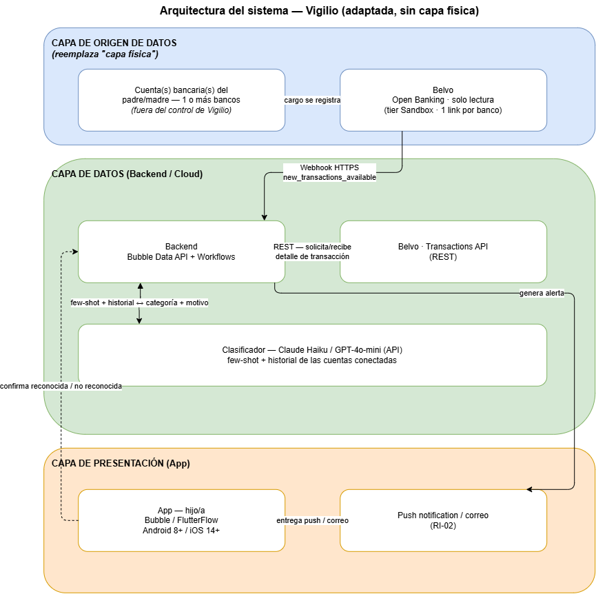

# Semana 05 - PDS y Arquitectura del Sistema

**Periodo:** 18–25 de septiembre de 2026
**Estado:** cerrado — PDS de 22 requerimientos (auditado dos veces), arquitectura de 3 capas con diagrama, ejercicio de presupuesto con cifras reales.

**Nota de privacidad:** esta página no incluye nombres completos de personas ni enlaces personales de nadie fuera de mí. Cuando menciono a mi profesor, lo hago sin su nombre — su retroalimentación y su plantilla de clase sí se citan, pero como "mi profesor", igual que en la Semana 4.

## Lo que hice esta semana

Esta semana tenía dos entregables oficiales según el syllabus real de la materia: el PDS (Product Design Specification, práctica IEEE 830-1998) y el diagrama de arquitectura del sistema. Los dos quedaron completos, pero el camino no fue una sola corrida limpia de un prompt — fue iterativo, con al menos un error de proceso real que decidí no esconder. Lo documento así porque es más defendible frente a mi profesor que presentar el resultado final como si hubiera salido perfecto a la primera.

## El PDS, en cuatro rondas: de 8 a 22 requerimientos

Empecé con un prompt propio, estilo "director de proyectos", pidiendo 2 requerimientos por categoría (funcionales, desempeño, interfaz, restricción) — salieron 8. Antes de dármelos, Claude verificó una cifra real: según Condusef, los adultos mayores de 60+ concentraron el 32% de las quejas por posible delito financiero en México en 2025, y una de las tres fuentes de fraude que identifica la propia autoridad es el entorno familiar (hijos, nietos o cuidadores) que usa la tarjeta sin autorización (Zócalo, 2026). Ese hallazgo obligó a incluir, desde el primer intento, un requerimiento de restricción sobre consentimiento y alcance del acceso del hijo/a cuidador — para que Vigilio no termine pareciendo la misma herramienta que la autoridad describe como parte del problema.

Antes de comparar contra el prompt del profesor, decidí completar primero mi propia versión, para que la comparación fuera justa: 16 contra 16, no 8 contra un prompt que ya pide completar huecos. Los 8 requerimientos nuevos quedaron, igual que los primeros, anclados a evidencia real del proyecto y no a texto genérico: entre ellos, la interfaz de transparencia regulatoria (RI-04) y su restricción asociada (RR-04) nacen directo del hallazgo de mi novena entrevista (José, sobre la condición regulatoria — Semana 4).

Con los 16 completos, corrí una primera auditoría informal contra la rúbrica real de mi profesor (el formato "El sistema debe [verbo] [qué] [condición]" y la distinción entre *first-iteration product* y prototipo de exploración). Encontré dos huecos reales frente a los ejemplos de mi profesor: una restricción de compatibilidad de plataforma y una restricción de tiempo con semana objetivo. Se agregaron como RR-05 y RR-06 — 18 requerimientos.

**El error de proceso que no escondí.** Al revisar el registro para documentar el siguiente paso, encontré que el texto exacto de esa primera auditoría nunca quedó guardado — el documento decía que sí estaba ahí, y no era cierto. En vez de reconstruirlo de memoria y presentarlo como si fuera el original, fui (con Claude) a buscar el prompt real de mi profesor directamente en el código fuente de su página de clase en GitHub — la página renderizada lo resume por espacio, pero el markdown crudo lo trae completo. Con el "Prompt 2" verbatim de mi profesor, corrí una segunda auditoría, esta vez limpia y completamente documentada.

Esa segunda auditoría confirmó los dos hallazgos anteriores y encontró cuatro huecos nuevos que la ronda informal no había visto: nadie describía cómo se conecta una cuenta bancaria por primera vez, qué pasa si falla la integración con Belvo o con el clasificador, un mínimo de accesibilidad para el padre o madre que usa la app, y qué pasa con los datos ya descargados si alguien revoca su consentimiento. De los seis huecos que salieron del análisis, adopté cuatro después de revisarlos uno por uno — no los seis: descarté una meta de intervalo de sincronización de Belvo por ser redundante con un requerimiento que ya existía (RD-01). En uno de los cuatro sí puse resistencia inicial ("no aplicaría tanto porque Belvo nada más sería para leer"), pero la sostuve al ver el argumento completo: que la integración sea de solo lectura no reduce la gravedad de que una falla pase desapercibida — lo que está en juego no es que Vigilio mueva dinero por error, es que el hijo/a deje de enterarse de un cargo real durante la ventana en la que el producto promete avisar.

El PDS final quedó en **22 requerimientos** — 4 funcionales originales + 2 nuevos (RF-05, RF-06), 4 de desempeño, 4 de interfaz + 1 nuevo (RI-05), y 6 de restricción + 1 nuevo (RR-07, que fusiona retención/cifrado y eliminación al revocar consentimiento, en vez de dejarlos como dos requerimientos redundantes).

Algunos ejemplos representativos, uno por categoría:

| Categoría | Requerimiento | Enunciado (resumido) |
|---|---|---|
| Funcional | RF-01 | Detectar y clasificar transacciones nuevas en al menos 3 categorías de anomalía, usando un modelo de lenguaje vía API con ejemplos de referencia. |
| Desempeño | RD-01 | Entregar la alerta al hijo/a en un plazo máximo definido desde que Belvo reporta la transacción (sujeto a validar con el piloto). |
| Interfaz | RI-01 | Integrarse con Belvo exclusivamente en modo de solo lectura, soportando más de un banco por padre/madre. |
| Restricción | RR-01 | Requerir consentimiento explícito, informado y revocable del padre/madre; limitar lo que el hijo/a ve exclusivamente a alertas ya clasificadas, nunca a movimientos completos. |

## La arquitectura: adaptada de un producto físico a uno que no lo es

El material de mi profesor para esta semana asume un producto mecatrónico con sensor propio, PCB y manufactura — Vigilio es exclusivamente software. En vez de forzar el formato o dejar secciones en blanco, adapté cada elemento explícitamente y lo declaré así: la "capa física" se convirtió en **capa de origen de datos** (la cuenta bancaria del padre/madre, leída por Belvo), los protocolos MQTT/BLE (pensados para dispositivos de radio con batería limitada) se convirtieron en **Webhook HTTPS + REST** (lo que Belvo realmente ofrece), y la "viabilidad de manufactura para 5-10 unidades" se convirtió en **viabilidad de piloto de software**.

La decisión de dónde corre el modelo de IA quedó en **Cloud**, justificada en tres puntos: no hay un dispositivo de campo con conectividad incierta (el dato ya nace en el banco, en la nube, antes de que Vigilio lo toque); el margen de latencia acepta minutos, no milisegundos; y el clasificador necesita contexto amplio (historial reciente de la cuenta como línea base) que no cabe en ningún dispositivo del usuario.

Diagrama de arquitectura (3 capas — origen de datos, datos, presentación):

Sobre esta arquitectura hice dos ajustes después de la primera versión, los dos motivados por preguntas que me hice yo mismo, no por instrucción externa:

1. **Línea base histórica.** Si alguien compra algo en Oxxo, ¿cómo sabe el sistema que es normal y no un cargo sospechoso? Necesita historial de la cuenta. Descarté que el hijo/a suba estados de cuenta a mano — contradice directamente RR-01 (el hijo/a solo ve alertas, nunca movimientos completos) y suma trabajo de ingeniería innecesario. En vez de eso, usé el mecanismo nativo de Belvo: al crear la conexión con `fetch_resources: ["TRANSACTIONS"]`, Belvo dispara una recuperación histórica asíncrona y avisa por webhook cuando termina — el backend usa esos datos como contexto interno del clasificador, sin que el hijo/a los vea ni los suba nunca.
2. **Cobertura multi-banco.** Decidí que Vigilio debe poder conectar todos los bancos que tenga el padre/madre, no solo uno — cubrir un solo banco no sería un diferenciador real frente a revisar el estado de cuenta a mano, banco por banco. Investigué cómo funciona esto en Belvo: cada banco es una conexión (link) independiente y un mismo usuario puede mantener varias activas a la vez. Encontré también un límite real que no depende de mí: Belvo no publica una lista fija de qué bancos mexicanos cubre para el producto de cuentas bancarias — solo una cifra de marketing ("+90% de las cuentas en América Latina"). Me queda pendiente verificarlo yo mismo en el dashboard antes de anunciar "todos tus bancos" como diferenciador en la página de lanzamiento.

Una limitación que dejé explícita y no escondida: a diferencia de un sensor con capa edge, Vigilio no tiene forma de degradarse con elegancia si Belvo o el clasificador fallan — la única opción es reintentar o avisar del retraso (ya formalizado como RF-06), nunca un modo "offline".

## El ejercicio de presupuesto: ¿alcanza $3,000 MXN?

Mi profesor usa $3,000 MXN como ejemplo de presupuesto de materiales para un prototipo físico. Como Vigilio no tiene materiales, corrí el mismo ejercicio con los costos reales de software que sí existen: Belvo en modo Sandbox y el clasificador de IA son prácticamente gratis (fracciones de centavo de dólar por clasificación), pero publicar la app "en vivo" — fuera del editor de Bubble o FlutterFlow, para que un piloto real la use — sí cuesta, entre $686 y $1,037 MXN al mes según el builder.

Con esas cifras, el presupuesto de $3,000 MXN alcanza con margen: entre $0 (si la demo de la Semana 7 se queda dentro del editor, sin publicar) y poco más de $2,000 MXN (si se publica de verdad para un piloto de dos meses). Donde el presupuesto sí se dispararía, y por mucho, es si el proyecto intentara salir del tier gratuito de Belvo (Sandbox) hacia producción: ahí el costo salta a cerca de $1,000 USD al mes (~$17,580 MXN), varias veces cualquier presupuesto de estudiante — que es exactamente la razón, ya documentada, de por qué el plan se queda en Sandbox durante todo el semestre.

## Lo que cambió

El patrón de Semana 3 (verificar el nombre de marca en la fuente en vez de confiar en lo ya escrito) se repitió aquí con el prompt de auditoría: el documento decía que un prompt estaba guardado, y cuando fui a confirmarlo no era cierto. En vez de taparlo con una reconstrucción inventada, fui a la fuente original — el repositorio de mi profesor — y lo corrí de verdad. Eso cambió el resultado: la auditoría limpia encontró cuatro huecos reales que la ronda informal anterior no había visto. Verificar en la fuente, otra vez, valió más que confiar en lo que ya estaba escrito.

## Referencias (APA-7)

Anthropic. (2026). *Pricing.* Claude Developer Platform. https://platform.claude.com/docs/en/about-claude/pricing

Baltes, M. M. (1995). Dependency in old age: Gains and losses. *Current Directions in Psychological Science, 4*(1), 14–19. https://doi.org/10.1111/1467-8721.ep10770949

Banxico. (2026, 24 de septiembre). Tipo de cambio FIX [citado en] El Mañana de Nuevo Laredo. *Tipo de cambio dólar-peso hoy 24 de septiembre 2026.* https://elmanana.com.mx/nacional/2026/9/24/tipo-de-cambio-dolar-peso-hoy-24-de-septiembre-2026-181187.html

Barber, P., Soubutts, E., Knowles, B., & Singh, A. (2025). Beyond the "unofficial proxy": Navigating technology support for older adults' banking activities with close others. En *Proceedings of the 2025 CHI Conference on Human Factors in Computing Systems (CHI '25)* (pp. 1–16). ACM. https://doi.org/10.1145/3706598.3713160

Belvo. (2026a). *Plans and pricing.* https://belvo.com/plans-and-pricing/

Belvo. (2026b). *Asynchronous workflows.* Developer resources. https://developers.belvo.com/developer_resources/resources-asynchronous-workflows

Belvo. (2026c). *Introduction* [Links overview]. Developer resources. https://developers.belvo.com/developer_resources/resources-links-overview

Belvo. (2026d). *Sandbox.* Developer resources. https://developers.belvo.com/developer_resources/resources-sandbox

Belvo. (2026e). *Banking* [Product page]. https://belvo.com/products/banking/

Bubble. (2026). *Pricing — Start free, scale as you grow.* https://bubble.io/pricing

El Financiero. (2026, 7 de enero). El emprendimiento demanda: Open Finance lleva a la CNBV ante el juez [Columna de opinión]. https://www.elfinanciero.com.mx/opinion/colaborador-invitado/2026/01/07/el-emprendimiento-demanda-open-finance-lleva-a-la-cnbv-ante-el-juez/

IEEE. (1998). *IEEE recommended practice for software requirements specifications* (IEEE Std 830-1998). Institute of Electrical and Electronics Engineers.

LatamFintech. (2022, 29 de junio). Belvo, fintech de Open Banking, obtiene la autorización de la CNBV para operar como IFPE en México. https://www.latamfintech.co/articles/belvo-fintech-de-open-banking-obtiene-la-autorizacion-de-la-cnbv-para-operar-como-ifpe-en-mexico

Lowcode Agency. (2026, septiembre). FlutterFlow pricing explained: plans and real costs (Sept 2026). https://www.lowcode.agency/blog/flutterflow-pricing-plans

N+. (2026, 18 de septiembre). Proponen blindar la pensión de adultos mayores 2026 y frenar el robo por hijos, nietos o cuidadores. https://www.nmas.com.mx/nacional/proponen-blindar-la-pension-de-adultos-mayores-2026-y-frenar-robo-por-hijos-nietos-o-cuidadores/

Zócalo. (2026, 13 de abril). Adultos mayores concentran el 32% de las quejas por fraude financiero: Condusef. https://www.zocalo.com.mx/adultos-mayores-concentran-el-32-de-las-quejas-por-fraude-financiero-condusef/

## Evidencia

Como evidencia documento los prompts reales que usé para construir y auditar el PDS, y para adaptar la arquitectura del sistema a un producto exclusivamente de software, con su nivel de fidelidad marcado.

[Ver el proceso completo (prompts y resultados) →](./evidencia-semana-05.html)

## Reflexión

Lo que más hice esta semana, en el fondo, fue encontrar cómo iba a ser el funcionamiento real de la aplicación: qué cosas no estaban cubiertas todavía y que podrían convertirse en un problema más adelante, y separar qué es externo a la aplicación (el banco, Belvo, el marco regulatorio) de cómo la aplicación misma iba a operar por dentro. Parte de ese ejercicio fue revisar si esa operación se desviaba o no de lo que yo ya había propuesto que el proyecto iba a cumplir — por ejemplo, si en algún punto le estaba quitando autonomía al padre o a la madre sin darme cuenta, o si de verdad se sostenía el límite de que el hijo/a solo ve alertas y nunca puede bloquear o controlar el gasto. También tuve que aterrizar cómo se conecta Belvo con la aplicación y viceversa, cómo se usa en la práctica, y cómo es el flujo completo de principio a fin — el "layout" real de cómo funciona todo, no solo la idea de que "detecta y avisa".

El PDS, en ese sentido, no fue un trámite aparte de la arquitectura — fue lo que me obligó a dejar muy claro y específico cada punto antes de construir la aplicación en sí: qué debe hacer exactamente, qué tan rápido, con qué límites, y qué pasa cuando algo falla. Sin ese nivel de detalle, hubiera llegado a la construcción con huecos que solo se habrían visto hasta que algo ya no funcionara.
