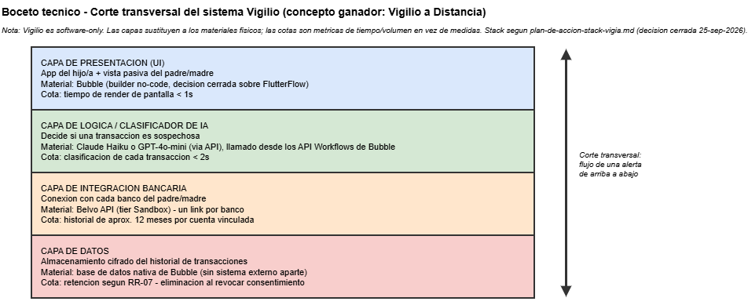
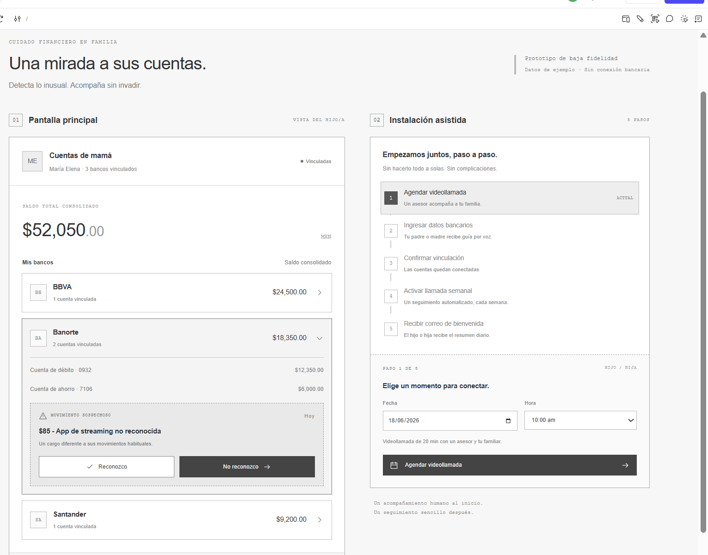
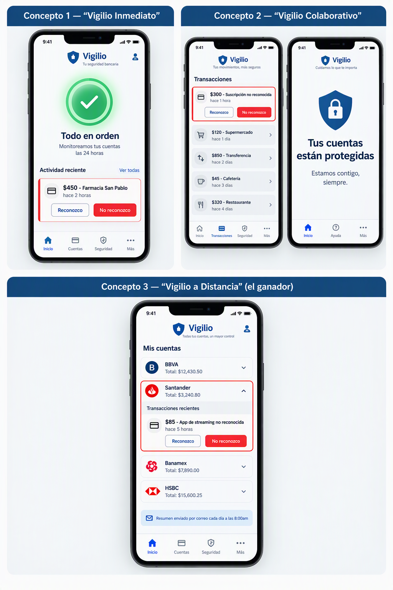
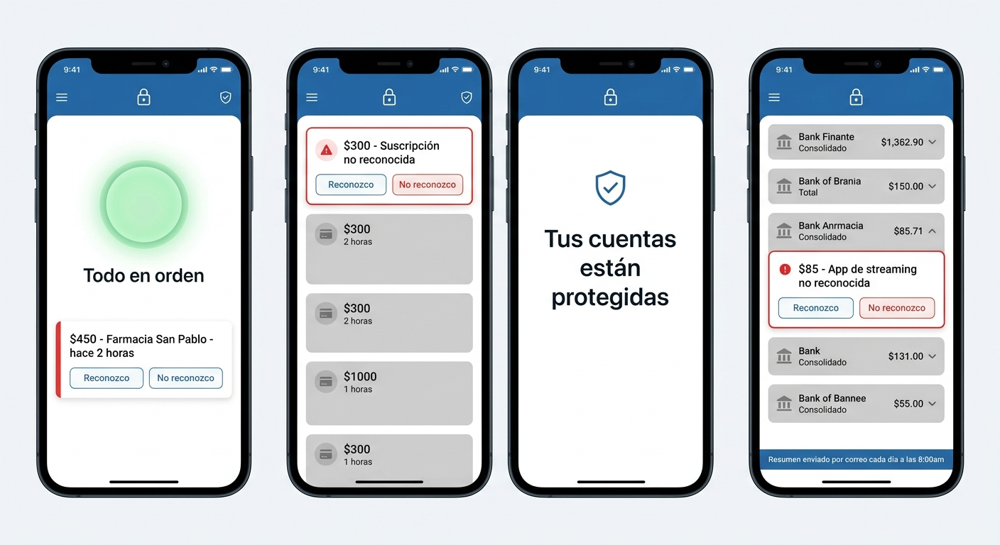

# Semana 06 - Generación y Selección de Concepto de Diseño

**Periodo:** Semana 6 del semestre
**Estado:** cerrado — 3 conceptos de diseño comparados en una Matriz de Pugh, boceto técnico adaptado a software (corregido), wireframe de baja fidelidad terminado en Figma, crítica técnica y defensa de concepto completas.

**Nota de privacidad:** esta página no incluye nombres completos de personas ni enlaces personales de nadie fuera de mí. Cuando menciono a mi profesor, lo hago sin su nombre, igual que en semanas anteriores.

## Lo que hice esta semana

Empecé verificando directo en la fuente del curso qué pedía realmente la Semana 6, en vez de asumir por el nombre del bloque. Encontré los 7 principios de diseño del curso (Affordances, Contour bias, Consistencia, Constraints, Confirmación, Costo-beneficio, Ciclo de desarrollo) y los cuatro entregables formales: mínimo 3 conceptos de diseño, una Matriz de Pugh completa, un boceto técnico del concepto elegido, y un wireframe de baja fidelidad de la app.

## Los 7 principios, aplicados (y corregidos) a Vigilio

Al aplicar los 7 principios a Vigilio corregí varias ideas iniciales propias. Confundí al inicio el contour bias con ahorro de manufactura — ese principio aplica a carcasas físicas, pero el argumento correcto es psicológico: las formas curvas generan más confianza que las angulosas, un efecto documentado en investigación de percepción visual (Bar & Neta, 2006). También estuve a punto de reutilizar los colores de alerta de la app en la publicidad del producto, lo cual habría roto la señal de alerta dentro de la misma app. Y entendí que el principio de "ciclo de desarrollo" no es un recordatorio de empatía con el usuario, sino una advertencia contra el costo hundido: los 3 conceptos de diseño tenían que ser genuinamente distintos entre sí, no variaciones superficiales de la misma idea.

## La tabla morfológica

Construí una tabla morfológica con 7 parámetros de diseño por 3 variantes cada uno, con una anotación de complejidad técnica por variante — vinculación y consentimiento inicial, canal principal de alertas, nivel de automatización de la respuesta, interfaz principal del hijo/a, participación del padre/madre, personalización de umbrales de alerta, y gestión de múltiples cuentas/bancos. El detalle completo de las 21 variantes está en la evidencia.

## Las analogías tecnológicas: el mismo hallazgo, por dos caminos distintos

Para los tres parámetros más débiles de la tabla — canal de alertas, automatización de la respuesta, y gestión multi-banco — corrí un ejercicio de analogías tecnológicas por partida doble: mi propia versión del prompt y la versión real de mi profesor, verificada directamente en el repositorio del curso. Ambas versiones convergieron en los mismos tres hallazgos:

- El canal de alertas debería escalar por severidad en vez de ser fijo (push → WhatsApp/SMS → llamada), como en los sistemas de alerta médica para adultos mayores y las alertas de fraude bancario en tiempo real.
- La automatización debería actuar como filtro antes de molestar al hijo/a, automatizando por completo solo con alta confianza del clasificador — como en los sistemas de seguridad doméstica (Ring, ADT) y el triage de las líneas de atención a fraude.
- La vista multi-banco debería ser unificada, con etiqueta visual del banco de origen — como en los agregadores financieros (Fintonic, Finerio), las apps de correo multi-cuenta y los wallets cripto multi-cadena.

Que la versión abierta (la mía) y la estructurada (la del profesor) llegaran a la misma conclusión me dio bastante confianza en que el hallazgo era real, no un capricho del formato del prompt. Por decisión mía, la tabla morfológica no se modificó con estos hallazgos — se mantuvieron las variantes A/B/C tal como estaban, y estos tres hallazgos quedaron como criterio racional para elegir combinaciones en el siguiente paso.

## Tres conceptos genuinamente distintos

Combinando variantes de la tabla morfológica armé tres conceptos de diseño distintos entre sí, no variaciones de la misma idea:

**Vigilio Inmediato** — onboarding delegado al padre/madre, umbral adaptativo, escalamiento automático a un segundo familiar. App: semáforo verde/rojo, acción directa desde WhatsApp/SMS. Landing: *"Protege a tus papás sin tener que estar pegado al celular."*

**Vigilio Colaborativo** — onboarding conjunto, decisiones 100% manuales, umbral ajustable con mínimo y máximo. App: feed cronológico con botones "reconozco"/"no reconozco". Landing: *"La tranquilidad de saber qué pasa con la cuenta de tus papás, juntos."*

**Vigilio a Distancia (ganador)** — onboarding asistido por videollamada, resumen diario por correo organizado por banco, llamada automatizada semanal al padre/madre. App: vista jerárquica por banco, se expande sola donde hay una alerta. Landing: *"Un resumen al día, sin saturarte de notificaciones."*

## La Matriz de Pugh: ganó el concepto que no esperaba

Comparé los tres conceptos con Vigilio Colaborativo como datum, en 9 criterios — 55% de peso en deseabilidad (velocidad de alerta 15%, facilidad de vinculación 12%, transparencia/confianza 10%, baja carga de interrupciones 8%, alineación con el propósito 10%) y 45% en factibilidad (complejidad de desarrollo 15%, costo operativo 10%, tiempo de desarrollo 10%, escalabilidad 10%).

| Criterio (peso) | Inmediato | Colaborativo (datum) | A Distancia |
|---|---|---|---|
| Velocidad de alerta (15%) | + | datum | – |
| Facilidad de vinculación (12%) | – | datum | S |
| Transparencia/confianza (10%) | – | datum | S |
| Baja carga de interrupciones (8%) | S | datum | + |
| Alineación con el propósito (10%) | – | datum | + |
| Complejidad de desarrollo (15%) | – | datum | S |
| Costo operativo (10%) | – | datum | S |
| Tiempo de desarrollo (10%) | – | datum | S |
| Escalabilidad (10%) | + | datum | S |
| **Puntuación ponderada** | **–42** | **0** | **+3** |

Ganó **Vigilio a Distancia** — no el concepto más rápido ni el más automatizado, un resultado honesto y no necesariamente el que yo hubiera esperado antes de correr la matriz. Vigilio Inmediato perdió porque acumulaba las variantes técnicamente más caras y complejas de toda la tabla, y su umbral adaptativo arriesgaba justo la sensibilidad a cargos pequeños que es la razón de ser de Vigilio.

El riesgo principal del ganador también quedó documentado: su punto más débil es justo el criterio de mayor peso, velocidad de alerta (15%) — un resumen diario no es tiempo real. La iteración recomendada es adoptar del concepto Inmediato el escalamiento a notificación inmediata, pero solo para alertas de alta confianza del clasificador, dejando el resumen diario como comportamiento por defecto para el resto.

## El boceto técnico: traducir ingeniería mecánica a software

Este fue el punto donde más tuve que adaptar el ejercicio. La rúbrica pide cotas, materiales y sección transversal — lenguaje de ingeniería mecánica para un objeto físico que Vigilio no tiene. En vez de forzar materiales inventados, traduje el mismo concepto a software: un corte transversal de las capas del sistema, cada una con su "material" (la tecnología que la implementa) y su "cota" (una métrica de tiempo o volumen en vez de una medida física):

| Capa | "Material" | "Cota" |
|---|---|---|
| Presentación (UI) | Bubble (builder no-code, decisión cerrada en Semana 5 sobre FlutterFlow) | Render de pantalla < 1 s |
| Lógica / clasificador de IA | Claude Haiku o GPT-4o-mini vía API, llamado desde los API Workflows de Bubble | Clasificación por transacción < 2 s |
| Integración bancaria | Belvo API (tier Sandbox) | Historial de ~12 meses por cuenta |
| Datos | Base de datos nativa de Bubble (sin sistema externo aparte) | Retención según RR-07 (eliminación al revocar consentimiento) |

**Corrección que hice yo mismo, después de entregarlo:** la primera versión de este boceto decía "React Native/Flutter" como material de la capa de presentación, y una base de datos externa genérica para la capa de datos — ambos ya estaban mal, porque el stack quedó cerrado en Bubble desde la Semana 5 y no lo verifiqué contra ese documento antes de dibujar el boceto. Lo corregí en el archivo `.drawio` apenas lo noté.

## Crítica técnica del boceto

Antes de darlo por cerrado, sometí el boceto a una crítica técnica priorizada (máximo 3 problemas, no todo lo corregible):

1. **Llamada automatizada sin manejo de fallo:** si el padre/madre no contesta, no había reintento definido. Solución: 2 reintentos, y si ambos fallan, notificar al hijo/a.
2. **Sin escalamiento si el correo diario no se revisa:** una alerta real podría quedar enterrada. Solución: escalar a push/SMS inmediato solo cuando el clasificador tenga alta confianza.
3. **Belvo tratado como una sola unidad:** no distinguía que cada banco es un link independiente. Solución: anotar que cada banco tiene su propio estado de salud de conexión.

La fortaleza identificada: la separación en capas independientes permite agregar un banco nuevo o cambiar el clasificador sin tocar las demás capas. Veredicto: listo para desarrollo, con ajustes menores.

## El wireframe de baja fidelidad, en Figma

Armé el wireframe de baja fidelidad en Figma — no en el draw.io que generé inicialmente como referencia de respaldo: la pantalla principal con las cuentas agrupadas por banco y la alerta expandida, y el flujo de instalación asistida en 5 pasos.

[Ver el wireframe interactivo en Figma →](https://www.figma.com/make/7NO7cD9TAUvuXbwztLwh4L/Typewriter-Text-Effect)

## Defensa de concepto (guion de 3 minutos)

> **Minuto 1:** "Elegimos Vigilio a Distancia. Es una app organizada en capas de software, vinculada a las cuentas del padre/madre vía Belvo mediante una videollamada asistida. El usuario sabe que funciona porque recibe un resumen diario por correo y puede ver cada banco expandible con sus transacciones recientes."
>
> **Minuto 2:** "Lo elegimos sobre los otros dos porque en la Matriz de Pugh ganó en alineación con el propósito central y en baja carga de interrupciones. El Concepto 1 tenía ventaja en velocidad de alerta, pero perdió porque acumulaba las variantes más caras y complejas, y su umbral adaptativo arriesgaba la sensibilidad a cargos pequeños."
>
> **Minuto 3:** "El riesgo principal es que el resumen diario no es tiempo real. Lo mitigamos con un escalamiento híbrido: correo diario por default, push/SMS inmediato cuando el clasificador detecta alta confianza de fraude."

## Renders de apoyo visual (no calificado, pero parte del proceso)

Como apoyo visual, no como entregable calificado, generé renders del concepto ganador con dos herramientas de IA distintas, usando el mismo prompt en ambas:

Corrí el mismo prompt en Gemini como comparación, y el resultado se descartó:

Ambas herramientas acertaron en los textos de botones y mensajes de alerta ("Reconozco"/"No reconozco", "Todo en orden"), pero Gemini generó nombres de banco ilegibles o inventados ("Bank Finante", "Bank Anrmacia", "Bank of Brania"), mientras que Copilot (basado en DALL-E 3) renderizó nombres y logos de bancos reales y correctos (BBVA, Santander, Banamex, HSBC). No es casualidad: DALL-E 3 es consistentemente más preciso que el motor de Gemini renderizando texto legible dentro de una imagen, una diferencia técnica conocida entre ambos modelos — relevante aquí porque el render es de una pantalla llena de texto, no de un objeto sin texto.

## Estado de los entregables de la semana

| Entregable | Estado |
|---|---|
| Mínimo 3 conceptos de diseño | Hecho |
| Matriz de Pugh completa | Hecho |
| Boceto técnico del concepto elegido | Hecho, adaptado a software, en draw.io — corregido |
| Wireframe de baja fidelidad | Hecho, en Figma |

## Lo que cambió

El curso está diseñado pensando en un producto con hardware, y esta semana lo sentí más que en ninguna otra: la tabla morfológica, los renders y el boceto técnico asumen una carcasa, un material, una sección transversal. La lección no fue forzar a Vigilio a encajar donde no encaja, sino encontrar la traducción honesta de cada ejercicio — capas en vez de materiales, lógica del sistema en vez de artefacto físico — y dejar documentado por qué se adaptó así. También me quedó claro, con el resultado de la Matriz de Pugh, que el concepto más vistoso no siempre es el que mejor sirve al propósito del producto. Y el error del boceto técnico (usar un stack que ya no era el real) me recordó algo que ya había aprendido en semanas anteriores: verificar contra lo ya decidido, en vez de confiar en lo que ya estaba escrito, sigue valiendo la pena incluso después de entregar algo.

## Referencias (APA-7)

Bar, M., & Neta, M. (2006). Humans prefer curved visual objects. *Psychological Science, 17*(8), 645–648. https://doi.org/10.1111/j.1467-9280.2006.01759.x

## Evidencia

Como evidencia documento los prompts reales detrás de la tabla morfológica, las analogías tecnológicas, los 3 conceptos, la Matriz de Pugh, el boceto técnico y su corrección, la crítica técnica, y los renders de apoyo, con su nivel de fidelidad marcado.

[Ver el proceso completo (prompts y resultados) →](./evidencia-semana-06.html)
